 

<h1 align="center">Hi 👋, I'm Sadullah Sadi</h1>
<h3 align="center">A passionate frontend developer from Bangladesh</h3>

<h2 align="center">🚀 About Me</h2>

  Hi, I'm <b>Sadullah Sadi</b> 👋 
  A <b>CSE student</b> learning <b>Full Stack Development</b> 
  and exploring new technologies every day. 💻✨

  🔭 <b>Currently exploring:</b> Next.js and DSA

- 👨‍💻 All of my projects are available at [https://sadi-logic.github.io/My-Portfolio-Website/](https://sadi-logic.github.io/My-Portfolio-Website/)

- 💬 Ask me about **Full Stack(React,NextJS,JavaScript,TypeScript,Node,Express,MongoDB,)**

- 📫 How to reach me **sadullasadi99@gmail.com**

<h3 align="left">Connect with me:</h3>

<h3 align="left">Languages and Tools:</h3>

            

<h3 align="center">🌐 Connect With Me</h3>

  &nbsp;&nbsp;&nbsp;
  &nbsp;&nbsp;&nbsp;
  &nbsp;&nbsp;&nbsp;
  &nbsp;&nbsp;&nbsp;
  &nbsp;&nbsp;&nbsp;
  

 

